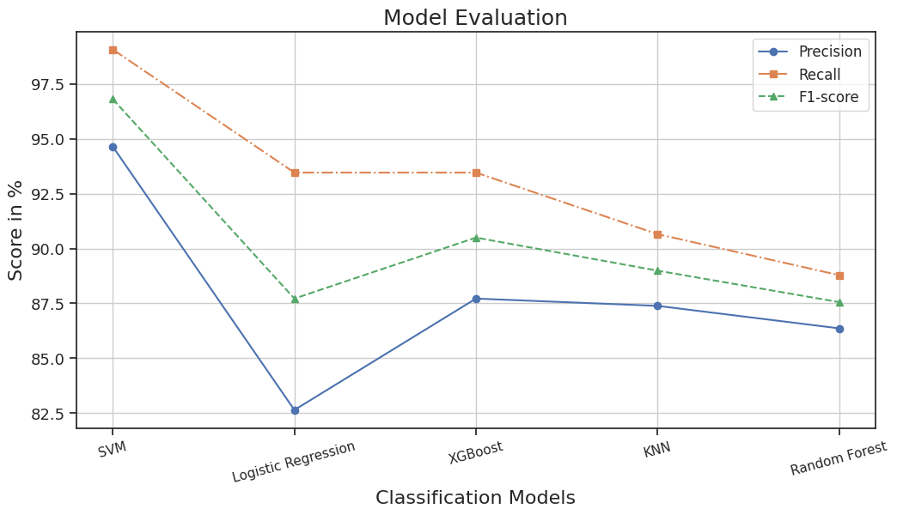
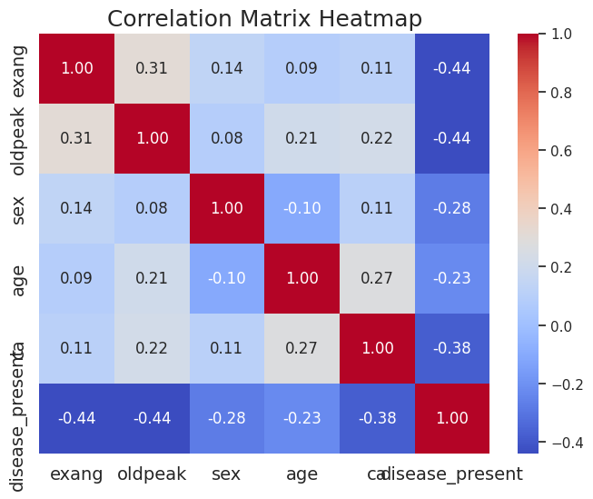
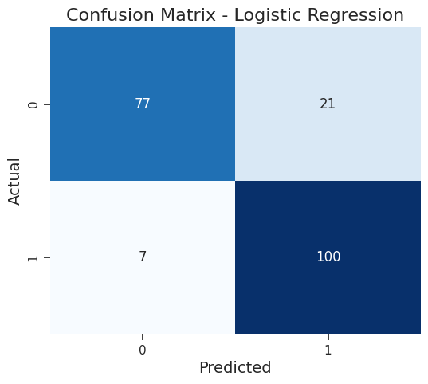
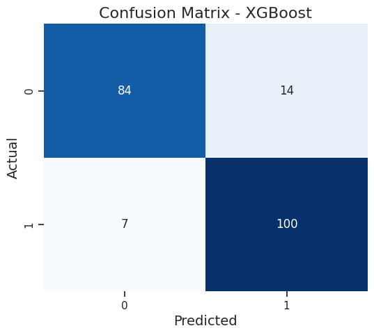
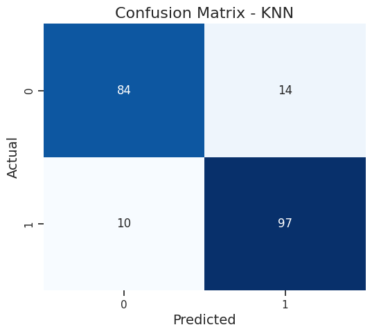
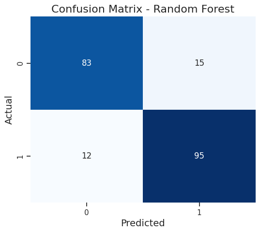

# Heart Disease Risk Prediction Using different Machine Learning algorithms

A comparison of five machine learning classification algorithms for heart disease 
risk prediction, evaluated using accuracy, precision, recall, F1-score, and AUC.

## Dataset
- **Source:** UCI Heart Disease Dataset (via Kaggle)
- **Records:** 303 patients
- **Features:** 13 (age, sex, chest pain type, resting blood pressure, etc.)
- **Target:** Binary classification (disease present / disease absent)

## Models Compared
- Support Vector Machine (SVM)
- Logistic Regression
- XGBoost
- K-Nearest Neighbors (KNN)
- Random Forest

## Methodology
- Data loading and missing value verification
- Exploratory data analysis (class distribution, feature distributions, correlations)
- Feature and target separation
- 80/20 train/test split with fixed random seed for reproducibility
- Feature scaling using StandardScaler
- Model training and evaluation with 5-fold cross-validation
- Overfitting analysis (training vs test accuracy comparison)

## Results

| Metric    | SVM    | Logistic Regression | XGBoost | KNN    | Random Forest |
|-----------|--------|---------------------|---------|--------|---------------|
| Accuracy  | 96.59% | 86.34%              | 89.76%  | 88.29% | 86.83%        |
| Precision | 94.64% | 82.64%              | 87.72%  | 87.39% | 86.36%        |
| Recall    | 99.07% | 93.46%              | 93.46%  | 90.65% | 88.79%        |
| F1-Score  | 96.80% | 87.72%              | 90.50%  | 88.99% | 87.56%        |
| AUC       | 0.99   | 0.94                | 0.97    | 0.97   | 0.95          |

## Visualizations

### Accuracy Comparison

### Precision, Recall & F1-Score Comparison

### ROC Curves

### Correlation Heatmap

### Confusion Matrices
| SVM | Logistic Regression | XGBoost |
|-----|-------------------|---------|
|  |  |  |

| KNN | Random Forest |
|-----|--------------|
|  |  |

## Key Findings
- SVM achieved the highest accuracy (96.59%) and AUC (0.99), making it the 
best performing model on this dataset
- XGBoost initially showed signs of overfitting (99.88% training accuracy) and 
was tuned by reducing estimators and tree depth to improve generalization
- All models achieved AUC above 0.94, indicating strong discriminative ability 
across all classifiers
- KNN showed the largest gap between test accuracy and cross-validation mean 
(88.29% vs 70.24%), suggesting sensitivity to data splits on this small dataset

## Tools & Libraries
Python, Scikit-learn, XGBoost, Pandas, NumPy, Matplotlib, Seaborn
